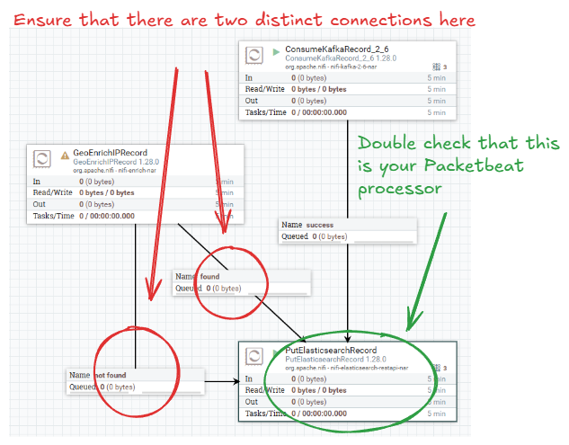
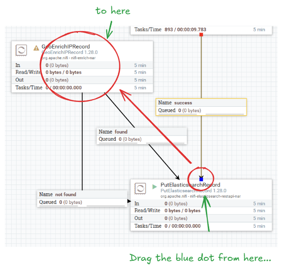
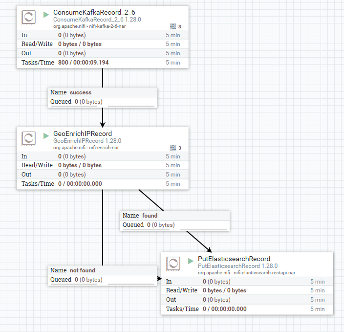

<!-- paginate: true -->

<style>
blockquote {
    font-size: 60%;
    margin-top: auto;
}
</style>

<style>
img[alt~="center"] {
  display: block;
  margin: 0 auto;
}
</style>

# Optional: NiFi Enrichment

---

# Record Paths

NiFi operates on JSON files using "Record Path" syntax, and is analogous to a file-path, with the root directory `/` being the root of the JSON object, and sub-keys being folder names. For example in the object:

```json
{
  "source": {
    "ip": "192.168.1.1",
    "ip.keyword": "192 168 1 1",
    "geo": {
      "country_name": "Unknown"
    }
  }
}
```
The path to the `country_name` is: `/source/geo/country_name`, and the path to `ip.keyword` is `/source/ip.keyword`.

---

# NiFi Enrichment

Add a GeoEnrichIPRecord processor to enrich the destination IP of events from Packetbeat.

Set the following settings on the GeoEnrichIPRecord processor:
- MaxMind Database File: `/opt/nifi/nifi-current/state/GeoLite2-City.mmdb`
- City Record Path: `/destination/geo/city_name`
- Latitude Record Path: `/destination/geo/location/lat`
- Longitude Record Path: `/destination/geo/location/lon`
- Country Record Path: `/destination/geo/country_name`
- Country ISO Code Record Path: `/destination/geo/country_iso_code`
- Country Postal Code Record Path: `/destination/geo/postal_code`

---

# NiFi Enrichment (2)

**Mini Exercise:** find the correct `IP Address Record Path` for the destination IP by inspecting queued FlowFiles as shown above. Also set the Record Reader and Record Writer to appropriate values.

**See next slide for the answer.**

---

# NiFi Enrichment (3)

**Exercise answer**: Fill in `/destination/ip` as the `IP Address Record Path` in the properties of the GeoEnrichIPRecord processor.

---

# NiFi Enrichment (4)

Hover over the GeoEnrichIPRecord processor to show the arrow icon, then drag it and **connect it to the PutElasticsearchRecord processor you configured for Packetbeat** to create a connection for the `found` relationship.

Now, hover over the GeoEnrichIPRecord processor and drag its arrow to the PutElasticsearchRecord processor *again*. This time, create the connection for the `not found` relationship.

Finally, open the settings of the GeoEnrichIPRecord processor and terminate the `original` relationship.

---

# NiFi Enrichment (5)

If done correctly, your connection should look like the diagram on the right.


Now, stop both the ConsumeKafkaRecord_2_6 and PutElasticsearchRecord processors for Packetbeat.

---

# NiFi Enrichment (6)

Click on the `success` relationship between ConsumeKafkaRecord_2_6 and PutElasticsearchRecord. A blue dot should appear in the arrowhead of the relationship. 

Drag the blue dot and connect it to the GeoEnrichIPRecord processor.



---

# NiFi Enrichment (7)

Finally, start all the processors. The final diagram should look like the image on the right.

Notice that almost all events are being sent to the `not found` relationship. This is normal as most of the traffic in your Kubernetes cluster consists mainly of connections between containers with private IP addresses.



---

# Next Steps

**Congratulations!**
You have successfully completed the following:
- Completed a deployment of a GeoIP enrichment processor
- Learned how to modify an existing transformation to insert a new processor
- Applied Record Paths to specify fields in JSON FlowFiles

**What's Next?**
You can go back to the main session [here](https://hautonjt.github.io/pipeline2.pdf#page=23).