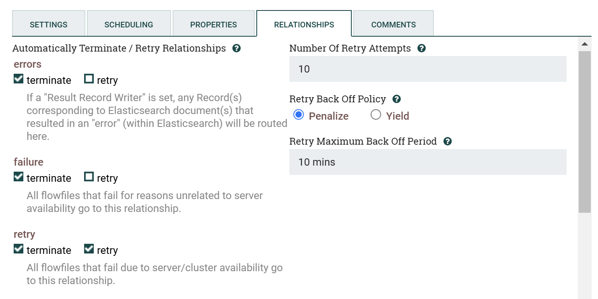

<!-- paginate: true -->

# Optional: NiFi Error Handling

---

# Error handling

## Dead Letter Queue

Add a new PutFile processor to store failed events to disk in order to create a Dead Letter Queue.

Double click the PutFile processor and set the following property:
- Directory: `/opt/nifi/nifi-current/state/dlq`

Now you need to configure your existing processors to send error events to the dead letter queue.

Hover over a ConsumeKafkaRecord_2_6 (doesn't matter which one), then drag its arrow to the PutFile processor, and specify the `parse.failure` relationship for the connection.

Repeat for all other ConsumeKafkaRecord_2_6 processors.

---

## Dead Letter Queue (2)

Now, hover over a PutElasticsearchRecord (doesn't matter which one), then drag its arrow to the PutFile processor, and specify the `failure` relationship for the connection.

Also, drag the same PutElasticsearchRecord's arrow to the PutFile processor again, and specify the `errors` relationship for the connection.

This creates a Dead Letter Queue that will store all events that the processor could not handle for some reason or another.

Repeat for all other PutElasticsearchRecord processors. For testing, having all the events go into a single Dead Letter Queue may be sufficient, but for production multiple queues will make identifying issues easier.

---

# Error Handling (2)

## Retry Configuration

Double click the PutElasticsearchRecord, navigate to the relationships tab, and select the "retry" option for the `retry` relationship. Leave the retry algorithm as-is, and press apply.

This will automatically configure 10 retries with exponential backoff.

Repeat for all other PutElasticsearchRecord processors.

---

# Next Steps

**Congratulations!**
You have successfully completed the following:
- Learned how to handle failure relationships
- Deployed a Dead Letter Queue
- Configured retry for a processor

**What's Next?**
You can go back to the main session [here](https://hautonjt.github.io/pipeline2.pdf#page=24).