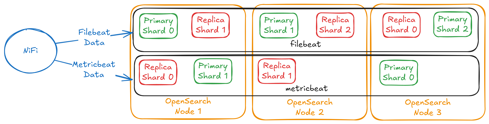
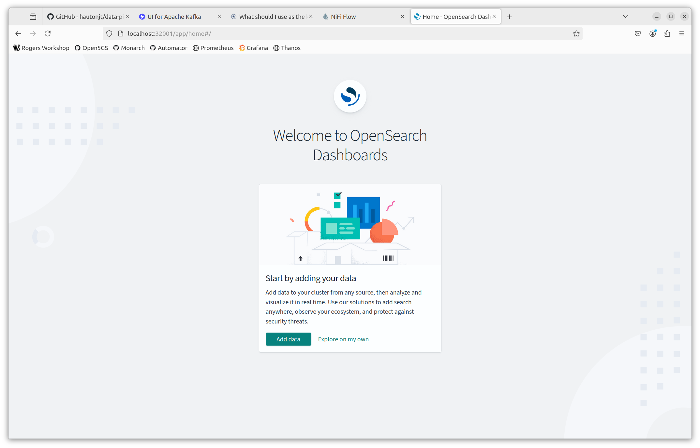
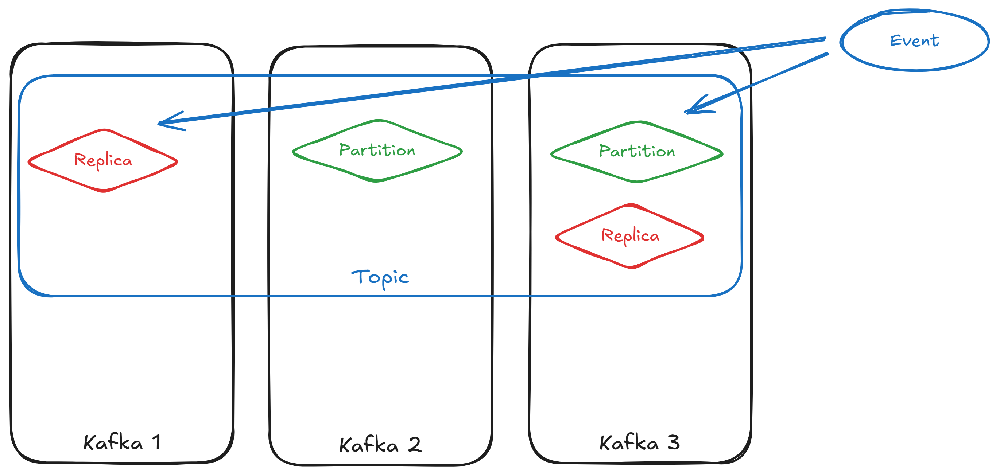
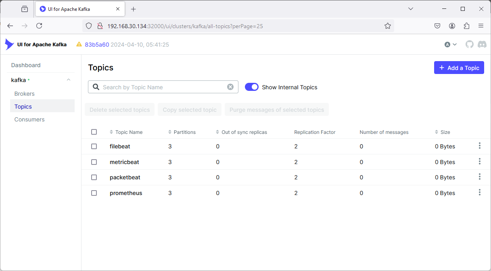

<!-- paginate: true -->

<style>
blockquote {
    font-size: 60%;
    margin-top: auto;
}
</style>

<style>
img[alt~="center"] {
  display: block;
  margin: 0 auto;
}
</style>


# Part 1 - Deployment

---

# Learning about data pipelines

This session will be all about the components of data pipelines. Specifically, we will be using the following components for our pipeline today:
  - Extractor: Filebeat, Metricbeat, and Packetbeat
  - Buffer: Apache Kafka
  - Transformer/Loader: Apache NiFi
  - Database: OpenSearch

However, to demonstrate the pipeline working, we need an environment to gather data from. So, we will be re-deploying the 5G core network and MonArch monitoring system from yesterday.

---

# Re-deploying the 5G Core

To begin, we will use `git clone` to fetch the source code of our data pipeline and re-create the entire Kubernetes setup we had deployed yesterday. 
```
cd ~
git clone https://github.com/hautonjt/data-pipeline
cd data-pipeline
./day1.sh
```

We will be extracting logs from every Kubernetes container using Filebeat, memory and CPU usage of the containers and hosts using Metricbeat, and network connection information using Packetbeat. We will also demonstrate how to extend Metricbeat to extract metrics from the Prometheus exporters in Monarch as well.

---

# How do we create a data pipeline?

Generally, in production we want to deploy a data pipeline in the following order:
  1. Database
  2. Buffer
  3. Transformer/Loader
  4. Extractors

The database and buffer are deployed first as they only receive events and do not send them. Once both the database and buffer have been set up, connecting them with a transformer/loader is trivial. Extractors are started last to prevent a build-up of events at the buffer while waiting for the transformer/loader to initialize.

---

# How do we create a data pipeline? (2)

However, for testing, it is easier to deploy the pipeline like this:
  1. Database
  2. Buffer
  3. Extractors
  4. Transformers/Loaders

By deploying the pipeline in this order, the extractors will send a bunch of events into the buffer first, which will allow you to inspect the structure of each event. This makes it much easier to check the events' schema as well as verify whether the information needed by the transformer is available. We will deploy our pipeline using this order.

---

# Deploying the database
First, let's deploy the OpenSearch cluster. Run the following:
```
cd ~/data-pipeline
./deploy-opensearch.sh 
```
> Note: you will need to type your password (`user`) for this script as it uses `sudo` internally

This script does the following:
  - Create a highly available OpenSearch cluster of 3 pods
  - Provision an instance of OpenSearch dashboards
  - Configure certificate-based authentication

---

# Switching namespaces

Both OpenSearch and OpenSearch dashboards should be deployed in a new namespace named `datapipeline`. This namespace is where all our new pipeline containers will be deployed to. 

Since we will be interacting with the `datapipeline` namespace the most in this lab, we can switch the namespace that `kubectl` is connected to by running:
```
kubectl config set-context --current --namespace=datapipeline
```
Now, if you run a kubectl command, such as,  `kubectl get pods`, it will run that command in the context of the `datapipeline` namespace by default.

---

# What is OpenSearch?

OpenSearch is a **fork** of ElasticSearch developed by Amazon. It was forked because the company developing ElasticSearch, Elastic NV, changed its license to restrict commercial usage.

Due to its common ancestry, many open-source tools that work with ElasticSearch also work with OpenSearch, including NiFi.

---

# How does OpenSearch Work?

Data stored in OpenSearch using indexes. Each index consists of a number of primary shards, which allow data to be spread across multiple machines. These shards can be configured with replicas to provided high availability.



---

# Access OpenSearch dashboards

To access the dashboards, navigate to <a href="http://localhost:32001" target="_blank">http://localhost:32001</a>. Both the username and password to log in are set to the value `admin`. If you reach the screen below, then OpenSearch has been deployed successfully. We will return to OpenSearch dashboards later on.



---

# Deploy Kafka

Now that OpenSearch is configured, we can install Apache Kafka. To deploy Kafka, ensure you are in the `data-pipeline` directory, and run:

```
./deploy-kafka.sh
```

This deploys both a Kafka cluster and Kafka-UI, which can be used to configure Kafka using a GUI. 

---

# What is Kafka?

Kafka is a distributed event store. Events in Kafka are mainly divided into *topics*, which are essentially categories of events. Topics are divided into partitions. These partitions allow events in a topic to be distributed across different instances of Kafka, and replicated partitions can provide fault-tolerance.



---

# What is Kafka? (2)

Topics can be configured to have any number of partitions. The higher number of partitions, the more distributed your data becomes, at the cost of some overhead. Data redundancy and availability is configured using the replication factor, and the number of in-sync replicas. 

### Replication factor
Replication factor controls the number of copies of each partition. Having a replication factor of 1 means only 1 copy of each partition, meaning no redundancy. Higher replication factors mean that data from a partition can still be available as long as one copy is still present.

---

# What is Kafka? (3)


### Min in-sync replicas
Each event must be present in at least *min in-sync replicas* before being successfully written. This minimizes the probability of data loss, but also means that if there are fewer than that many replicas of a partition are present, a partition could no longer be written to. 

### Data persistence

Unlike message queues like RabbitMQ, data stored in Kafka topics not deleted when events are processed. Deletion is instead controlled by a data retention setting. This means that if an issue occurs in the transformer causing events to be corrupted, events can be re-ingested from the same Kafka topic before retention expires. Kafka consumers need to keep track of what events it has read from a topic.

---

# Configuring Kafka

**1. Accessing Kafka-UI**
Once the deployment is done, the UI is accessible at <a href="http://localhost:32000" target="_blank">http://localhost:32000</a>.
**2. Create filebeat topic**
On the left sidebar, click *Topics*, then on the top right, select "Add a Topic". Fill out the following settings:
  - Topic Name: `filebeat`
  - Number of partitions: `3`
  - Min in-sync replicas: `2`
  - Replication factor: `2`
  - Time to retain data: `1 day` (select the "1 day" box below the input)

Then select "Create".

---

# Configuring Kafka (2)

**3. Mini-Exercise**

Repeat the prior steps with the topics "metricbeat", "packetbeat", and "prometheus". All other settings should remain the same. Your final screen topics screen should look something like this:



> Hint: Click on the *Topics* button in the sidebar again after creating a topic to access the "Add a Topic" button quickly.

---

# Configuring Beats Agents

Now, we will be deploying our Filebeat, Metricbeat, and Packetbeat agents. Out of the box, Beats supports Kubernetes natively, but we also want to gather metrics from the Prometheus exporters in Monarch. 

To do this, we will need a configure Metricbeat to find the Prometheus endpoints.


---

# Configuring Beats Agents (2)


In the `beats` folder in `data-pipeline`, you should be able to find a file called `metricbeat-prometheus.yaml`.

Find the section that looks like this:
```yaml
    metricbeat.modules:
      - module: prometheus
        period: 5s
        hosts: ["nssdc-kube-state-metrics.monarch.svc:8080"]
        metricsets: ["collector"]
        metrics_path: /metrics

      - module: prometheus
        period: 5s
        hosts: ["kpi-calculator-service.monarch.svc:9000"]
        metricsets: ["collector"]
        metrics_path: /metrics
```

---

# Configuring Beats agents

These are the endpoints for Prometheus collectors. We want to add the metrics from Monarch for slice monitoring metrics.

Go to <a href="http://localhost:30095/targets?search=" target="_blank">http://localhost:30095/targets?search=</a>, and find the endpoints. Two of them have already been configured. 

Add the AMF, SMF, and UPF endpoints on that page by replacing the `<insert AMF/SMF/UPF collector URL>` with the endpoints from Prometheus. Ensure that the port is included in the URL, but the `/metrics` subpath is removed.

> Note: answers are in the ~/data-pipeline/lab/metricbeat-prometheus.yaml file

---

# Deploy Beats

Now we deploy Filebeat, Metricbeat, and Packetbeat all at once. To do this, run:
```
./deploy-beats.sh
```

Filebeat, Metricbeat, and Packetbeat all produce events from different types of information. 

**Filebeat** reads informations mainly from log files and JSON HTTP endpoints. Filebeat has native integration with Kubernetes, enabling it to read the logs of all running containers, even ones deployed after Filebeat. For advanced use cases, Filebeat can also use Kubernetes annotations to separately parse the logs of certain containers if necessary.

---

# Deploy Beats (2)

**Metricbeat** reads metrics, typically resource usage, from the system. It also has native integrations with various metrics providers. Notably, this includes Prometheus, allowing us to integrate with Monarch. It also integrates with kube-state-metrics, which Monarch installs.

**Packetbeat** captures connection information from all network interfaces present in the current running machine. This includes ingress traffic, egress traffic, and network traffic traffic between pods.

Beats are designed to be deployed together, and have a unified schema. Thus, one advantage of using Beats is not having to worry about normalizing the schema in the transformer.

---

# Checking Output

If you check the Kafka UI at <a href="http://localhost:32000" target="_blank">http://localhost:32000</a>, you should be able to see messages in all the topics if you navigate to Topics on the left menu. Within each individual topic, you can view the messages within the topic by selecting the "Messages" tab. If you do not see messages, please ask for help.

---

# NiFi

Finally, we are deploying NiFi. Before deploying, To do this, run:
```
./deploy-nifi.sh
```
> Note: you will need to type your password (`user`) for this script as it uses `sudo` to copy the geoip database to a system directory.

This script does the following:
- deploys a NiFi cluster of 3 nodes
- deploys a Zookeeper cluster of 3 nodes (used by NiFi for maintaining configuration and cluster information)

Warning: this deployment takes a long time to complete.

---

# What is NiFi?

NiFi is a versatile distributed data processor. NiFi allows you to create data processing graphs that can allow you to visually see how data will be processed. 

# How does NiFi work?
NiFi operates using the concept of FlowFiles, which is just a container that can hold any data along with some attributes, which are essentially metadata. This means that FlowFiles inherently do not have any structure at all.

Processors act on FlowFiles and transforms them in some way. There are a vast array of processors that cater to almost any use case, and for use cases that built-in processors are incapable of handling, NiFi also supports calling external scripts as well. You can integrate ML with NiFi directly using processors instead of interfacing with Kafka.

---

# How does NiFi work? (2)

Since FlowFiles have no structure, typically services need to be specified so the processor knows how to parse the FlowFile and what format to output it in. For example, the `JsonTreeReader` service reads the FlowFile and parses it into one or more JSON object for processing. The `JsonRecordSetWriter` writes an array of JSON objects as its output.

Services are not limited to just parsing FlowFiles, they also provide services such as SSL authentication, OpenSearch integration, caching, lookups, and more. 

---

# Next Steps

**Congratulations!**
You have successfully completed the following:
- Deployed all the components of a data pipeline
- Configured Apache Kafka and Beats
- Customized Metricbeat configuration to pull metrics from Prometheus

**What's Next?**
Configure NiFi and visualizations in [Part 2](https://hautonjt.github.io/pipeline2.pdf).