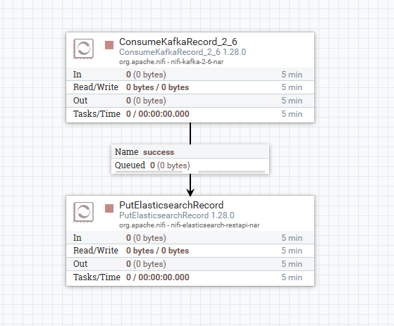

<!-- paginate: true -->

# Part 2 - Configuration

---

# Configuring NiFi Services

After NiFi has been deployed, we can start configuring it to consume events from Kafka and send them to OpenSearch. Once NiFi is ready, you should be able to access it by going to <a href="http://localhost:32002/nifi" target="_blank">http://localhost:32002/nifi</a>.

Before we begin, we need to define the services our processors will need. To do this, find the Settings button underneath the "NiFi Flow" text on the middle-left side of the screen. Selecting this should pop up the NiFi Flow Configuration screen. Then, select the "Controller Services" tab.

---

# Configuring NiFi Services (2)

After that, press the "+" symbol near the top-right side of the table to add a service. We will need to add the following services:
  - `JsonTreeReader`
  - `JsonRecordSetWriter`
  - `StandardRestrictedSSLContextService`
  - `ElasticSearchClientServiceImpl`

The JsonTreeReader and JsonRecordSetWriter can both be enabled immediately by clicking on the lightning bolts to the right of their respective rows and selecting "Enable" in the window that pops up.

> Note: once "Enable" has been clicked, the button will change to a "Cancel" button, so clicking again will cause the enable to be cancelled.

---

# Configuring NiFi Services (3)

StandardRestrictedSSLContextService needs to be configured by clicking the Settings button on its row, then going to the Properties tab. Fill in the following properties:
  - Keystore Filename: `keytool/keystore.p12`
  - Keystore Password: `keystore`
  - Key Password: (leave blank)
  - Keystore Type: `PCKS12`
  - Truststore Filename: `keytool/truststore.p12`
  - Truststore Password: `truststore`
  - Truststore Type: `PCKS12`

Then select apply.

---

# Configuring NiFi Services (4)

Next, we need to configure ElasticSearchClientServiceImpl. Click on the settings button to the right, and nagivate to Properties. Enter the following settings:
- HTTP Hosts: `https://opensearch-cluster-master:9200`
- Username: `admin`
- Password: `admin`
- SSL Context Service: `StandardRestrictedSSLContextService`

Click apply, then enable both the StandardRestrictedSSLContextService and the ElasticSearchClientServiceImpl.

---

# Configuring NiFi Processors

Double check to ensure that all your services are properly enabled. Every service should have a crossed-out lightning bolt symbol as shown below:

Once checked, exit out of the NiFi Flow Configuration screen. Now that all the services we need are enabled, we can now add the processors. In the top left of the screen, find the Processors icon. Click and drag the icon to create a new processor. Find the "ConsumeKafkaRecord_2_6" processor and add it.

---

# Configuring NiFi Processors (2)

Double click on the processor to open its settings, then set the following properties:
- Kafka Brokers: `kafka:9092`
- Topic Name(s): `filebeat`
- Value Record Reader: `JsonTreeReader`
- Record Value Writer: `JsonRecordSetWriter`
- Group ID: `nifi`
- Security Protocol: `SASL_PLAINTEXT`
- SASL Mechanism: `PLAIN`
- Username: `user1`
- Password: `kafka`

> Note: The username and password fields do not appear until SASL Mechanism is set to `plain`.

---

# Configuring NiFi Processors (3)

Create a PutElasticsearchRecord processor, and configure the following settings:
- Index: `filebeat`
- Client Service: `ElasticSearchClientServiceImpl`
- Record Reader: `JsonTreeReader`

Click apply. 

---

# Configuring NiFi Relationships

NiFi processors are connected with each other using relationships. All relationships need to be configured in order for a NiFi processor to be runnable. To view a processor's relationships, double click the processor to open its settings, then navigate to the "Relationships" tab to view its relationships. 

For example, the "ConsumeKafkaRecord_2_6" processor has two relationships: `success`, and `parse.failure`. Each relationship has a "terminate" and a "retry" box.

---

# Configuring NiFi Relationships

Below each relationship is a brief explanation. For example, in our case, the event will be sent to the `parse.failure` relationship if it is not a valid JSON file. Every relationship has both a "terminate" and "retry" option.  

---

# Configuring NiFi Relationships

Enabling the "retry" option will cause the event to be re-processed by the processor a set number of times in a configurable manner. The "terminate" option causes the event to be dropped. Both "retry" and "terminate" options can be enabled, which causes the event to be dropped after all retries have been exhausted.

Any relationship that does not have the "terminate" option enabled must be connected to another processor, even if "retry" is enabled on that relationship. We will be connecting our ConsumeKafkaRecord_2_6 processor to our PutElasticsearchRecord processor.

---

# Configuring NiFi Relationships

First, we need to terminate all the relationships we don't need. Open the ConsumeKafkaRecord_2_6 settings again. Go to the "Relationships" tab, and select "terminate" under `parse.failure`, and apply. 

Then, open the PutElasticsearchRecord processor settings, go to the "Relationships" tab, and select "terminate" for all relationships. We will be handling errors later. Exit out of the processor's settings.

---

# Configuring NiFi Relationships

Now, hover over the ConsumeKafkaRecord_2_6 processor until an arrow appears in the middle of it. Drag the arrow to the PutElasticsearchRecord processor. Select the `success` relationship, and apply. This creates a connection for the `success` relationship between the ConsumeKafkaRecord_2_6 and the PutElasticsearchRecord processors.

---

# Running NiFi processors
The screen should now look like this:

Now, for each processor, click on it once, and in the "Operate" panel on the left, select the "Play" button to run the processor.

> Note: if your processors are still displaying a yellow triangle instead of a "Stop" symbol, it has not been configured correctly. You can hover over the triangle to see the error. Please ask for help if you are stuck and the yellow triangle doesn't go away.

---

# Running NiFi processors (2)
The screen should now look like this:

You can stop the processor again by clicking on it once, then selecting the "Stop" button in the "Operate" panel on the left.

> Note: once a processor is running, its properties can no longer be edited. To edit the properties, stop the processor first. Once the processor is stopped, its properties can be edited again.

---

# Configuring Other Processors

**Duplicating processors**: To duplicate a processor, right click on it and select "Copy". Then right click on any blank space and select "Paste" to paste a copy of the processor with identical configuration.

Hint: You can select multiple processors by holding down "Shift".

### Mini-Exercise

Configure the processors for the *metricbeat*, *packetbeat*, and *prometheus* topics.

Ensure that both the Topic Name in the ConsumeKafkaRecord_2_6 processor and the Index in the PutElasticsearchRecord processor are set correctly.

---

# Inspecting FlowFiles

NiFi lets you inspect queued FlowFiles pretty easily. To do this, **you must first stop the PutElasticsearchRecord processor**. Then, right click the queue (i.e., the box labeled "success"). Then select "List queue". This shows a list of all FlowFiles in the queue. 

You can select the "eye" icon to view its content. **(If you get an error, ensure you stopped the PutElasticsearchRecord processor that was downstream from the queue.)**

In the "View as" selection box, select "formatted" to see the formatted JSON.

---

# Common Issues

If no events are arriving at your ConsumeKafkaRecord_2_6 processors after a while, ensure that the settings are correct by double clicking it and verifying the processor's properties. Common mistakes include:
- Leaving the Kafka Brokers value as `localhost:9092` instead of setting it to `kafka:9092`
- Typos being present in the Topic Name(s) field

---

# Configure OpenSearch

Now that everything is deployed, we can now visualize it in OpenSearch. Go to <a href="http://localhost:32001" target="_blank">http://localhost:32001</a>. Log in using username `admin` and password `admin` if prompted. 

Select "Explore on my own". Close the dialog box about the new theme. Then, select the menu button on the top left, scroll down and select "Dashboards Management". 

---

# Configure OpenSearch (2)

Create index patterns with the names `filebeat`, `packetbeat`, `metricbeat`, `prometheus`, and `*beat,prometheus`. Set the "Time field" to the value `@timestamp` for all of them.
> Hint: Click on "Index patterns" on the left to go back to the screen with the "Create index pattern" button.

---

# Configure OpenSearch (3)

### What are index patterns?
Index patterns allow you to search one or more indices in OpenSearch at the same time. We created index patterns for each type of data so we could search them individually, but also defined a `*beat,prometheus` pattern that matches all four of our indices.

---

# Check OpenSearch Configuration

Once you have created all your patterns, you should see the following:

If some patterns were added but don't show up, try refreshing the page.

---

# Searching Data

Open the menu, and select "Discover". Discover should look like this:

If you do not see any data, you can change the search time frame on the top right input to the left of the "Refresh" button. A relative time of "Past 1 hour" should yield some results.

You can also change the index patern using the field on the left side of the screen, to the left of the search box.

> Note: it is normal for the data in the "filebeat" index pattern to be older than the others.

---

# Creating Visualizations

Create a visualization to view data. To do this, select the menu button, and navigate to Visualize.

Create a new "Line" visualization, and choose the `prometheus` index pattern.

Click on the Y-axis to expand the aggregation. Select the `average` aggregation. For the field, select `prometheus.metric.slice_throughput` metric. Add an X-axis by selecting "Add" below the "Bucket" panel in the bottom right side of the screen. Add a date histogram to the X-axis using the `@timestamp` field. Press save on the top right and give it a title and optionally a description.

---

# Creating Visualizations (2)

If done correctly, the visualization settings should look like the image on the right. Click the "Update" button on the bottom right, then press the "Save" button on the top right. Give the visualization a name to save it.

---

# Creating Dashboards

Create a dashboard to view a collection of visualizations Select the menu button, and navigate to Dashboards under `OpenSearch Dashboards`. 
> Note: Be careful not to select the Observability dashboards. You should see a screen like the image below.

Select "Create new dashboard", then select "Add an existing", and add the visualization you just created. Press save on the top right and give it a title and optionally a description.

---

# NiFi Enrichment

If time permits, the NiFi enrichment slides can be found [here](https://hautonjt.github.io/exercise1.pdf).

---

# NiFi Error Handling

If time permits, the NiFi error handling slides can be found [here](https://hautonjt.github.io/exercise2.pdf).

---

# Next Steps

**Congratulations!**
You have successfully completed the following:
- Deployed a highly available data pipeline
- Configured agents to collect statistics from custom Prometheus exporters
- Learned about how to transform, enrich, and handle errors in data using NiFi
- Explored the data being sent by the agents using OpenSearch Dashboards

**What's Next?**
In the afternoon session, we will dive into [5G slice modeling and dynamic resource scaling](https://sulaimanalmani.github.io/5GDynamicResourceAllocation/slides.pdf).